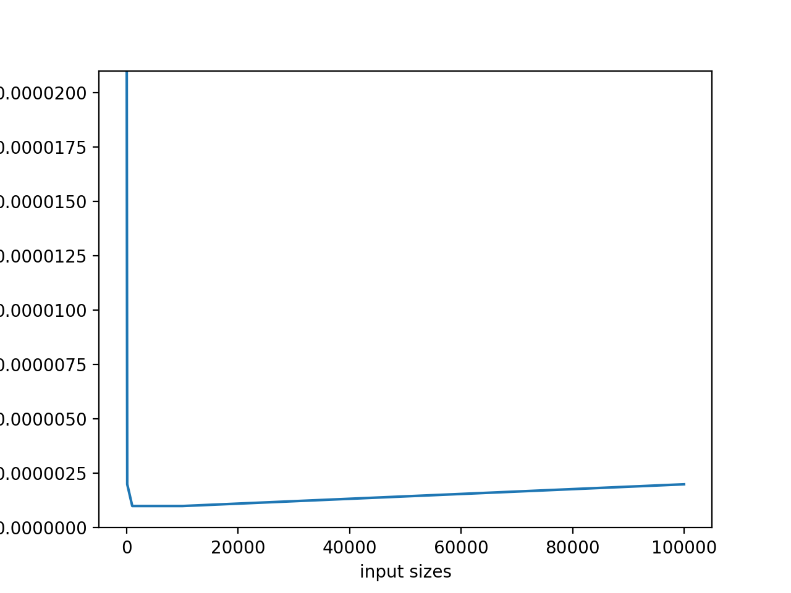
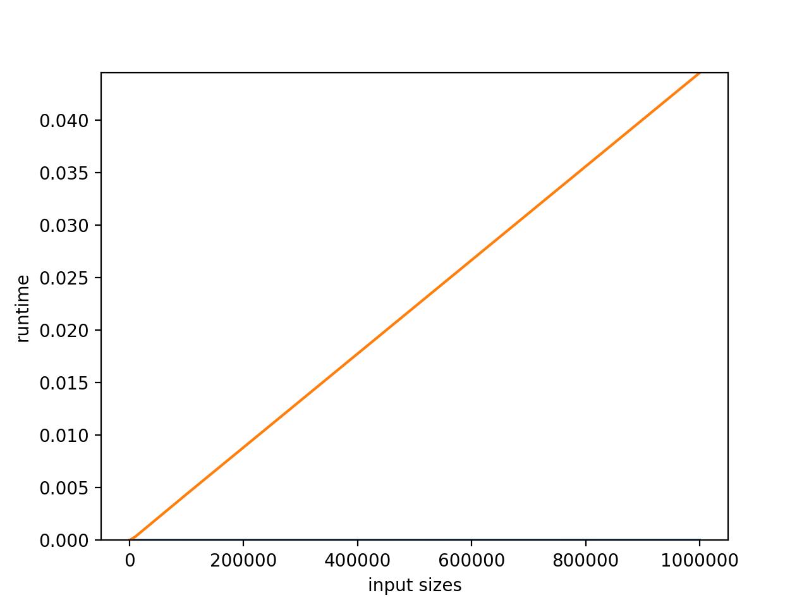
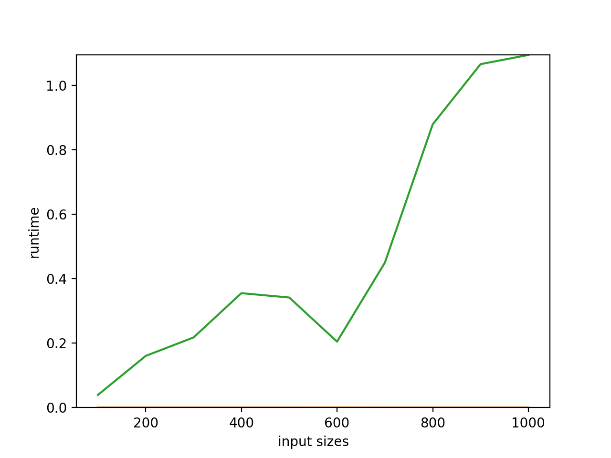
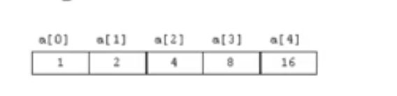
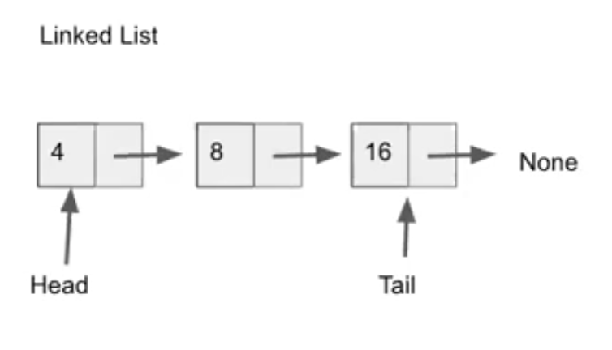
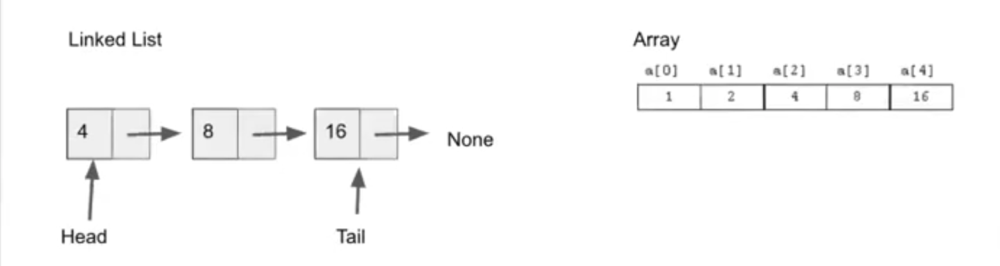
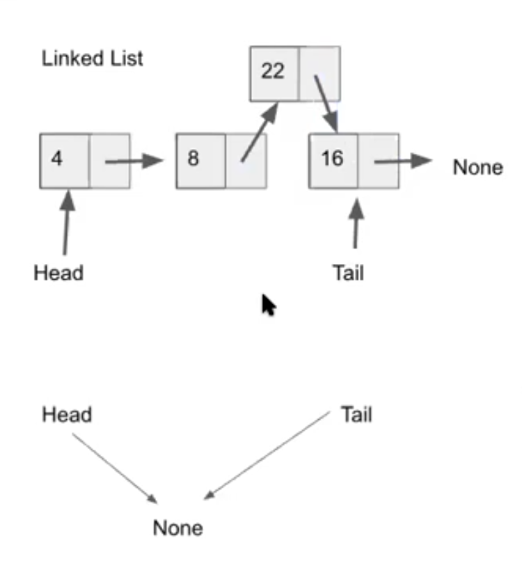
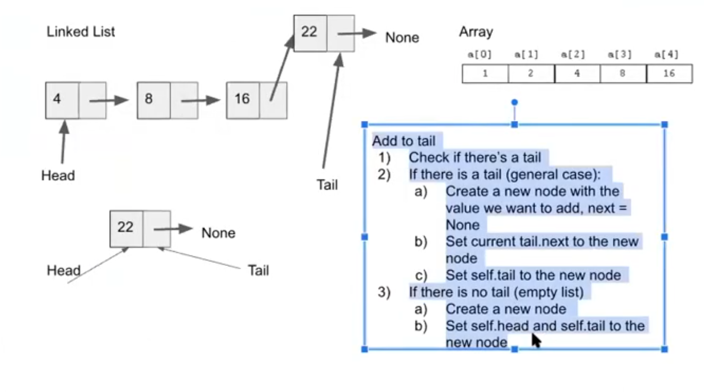
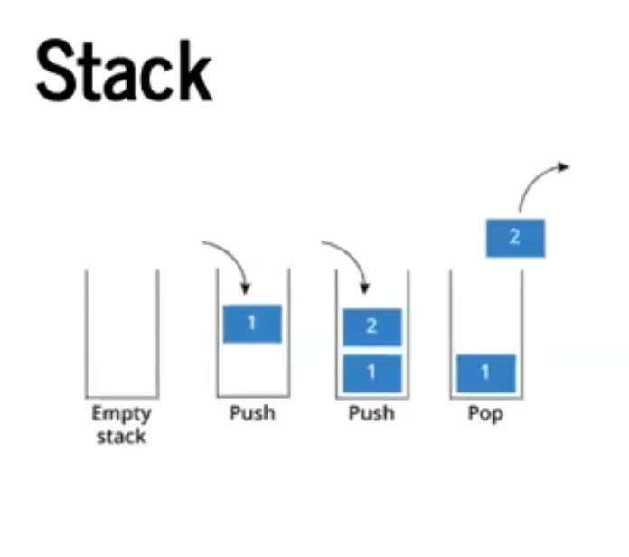
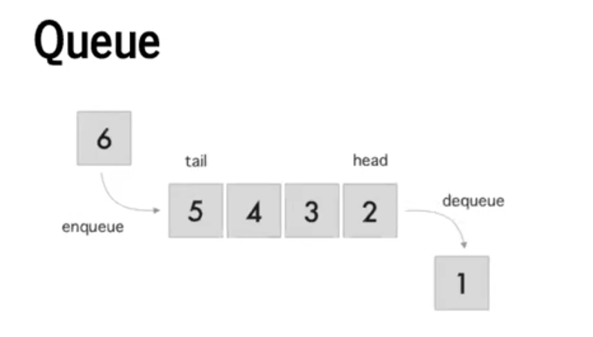

# Why study data structures?
- help understand how to manipulate / manage and organize data
    - how to use different data structures
    - how they're implemented
- efficiency, speed will the code scale
    - understand input and output sizes
- interview questions
- reusability

# Runtime Complexity
- A way to objectively compare the efficiency (i.e, number of operations) of difference pieces of code
- Measure the rate og growth: how the runitme increases as the size of the inpt increases
- Different categories of complexity

WHy can't we just compare how long they take to run directly?


# Big O
- consider runtime complexity in the *worst case* scenario
- for *large* input sizes
    - Think limits: as *n* approaches infinity, how does the runtime behave?

## Constant Time
- runtime does not depend on the size of the input -> constant
- O(1)


what are some examples of operations that run in constant time?
- indexting to a list
- accessing by key into dict
- loop that runs a set number of times
- looking up a name in a phone book
- addition, other operations

```
runtimes = compare_funcs([constant1], input_sizes=[10, 100, 1000, 10000, 100000])
plot_runtimes(runtimes)
```
-----, constant1, ---- \
10      0:00:00.000006 \
100     0:00:00.000002 \
1000    0:00:00.000001 \
10000   0:00:00.000001 \
100000  0:00:00.000002 \
{'constant1': [(10, 6e-06), (100, 2e-06), (1000, 1e-06), (10000, 1e-06), (100000, 2e-06)]}



## Linear Time
- runtime increases linearly as input size increase
- in Big-O Notation: O(n)

What does linear complexity look like if we plot it?
What are the examples of array or dictionary operations taht run in constant time?
- linear search
- looping
- counting coins
- summing

```
def linear1(nums:List):
    s = 0
    for n in nums:
        s += n

runtimes = compare_funcs([constant1, linear1], input_sizes=[10**2, 10**3, 10**4, 10**5, 10**6])
plot_runtimes(runtimes)
```
-----, constant1, ---- \
100     0:00:00.000007 \
1000    0:00:00.000002 \
10000   0:00:00.000001 \
100000  0:00:00.000003 \
1000000 0:00:00.000010 \
-----, linear1, ---- \
100     0:00:00.000014 \
1000    0:00:00.000037 \
10000   0:00:00.000335 \
100000  0:00:00.004387 \
1000000 0:00:00.044490 \
{'constant1': [(100, 7e-06), (1000, 2e-06), (10000, 1e-06), (100000, 3e-06), (1000000, 1e-05)], \
 'linear1': [(100, 1.4e-05), (1000, 3.7e-05), (10000, 0.000335), (100000, 0.004387), (1000000, 0.04449)]}



## Quadratic Time

- run time increases quadratically as input size increase
- as input size increases by a factor of 10x, runtime increases by 100x
- O(n^2)

What would it look like if we plotted it?


What are examples that run in quadratic time?
- nested loop
- bubble sort

```
def quadratic1(nums: List):
    combinations = []
    for i in nums:
        for j in nums:
            combination.append[(i, j)]

runtimes = compare_funcs([constant1, linear1, quadratic1], input_sizes=[10**2, 10**3, 10**4, 10**5])
runtimes = compare_funcs([constant1, linear1, quadratic1], input_sizes=[100, 200, 300, 400, 500, 600, 700, 800, 900, 1000])
plot_runtimes(runtimes)
```
-----, constant1, ---- \
100     0:00:00.000011 \
200     0:00:00.000004 \
300     0:00:00.000002 \
400     0:00:00.000001 \
500     0:00:00.000001 \
600     0:00:00.000002 \
700     0:00:00.000001 \
800     0:00:00.000003 \
900     0:00:00.000002 \
1000    0:00:00.000001 \
-----, linear1, ---- \
100     0:00:00.000009 \
200     0:00:00.000013 \
300     0:00:00.000012 \
400     0:00:00.000015 \
500     0:00:00.000018 \
600     0:00:00.000233 \
700     0:00:00.000026 \
800     0:00:00.000028 \
900     0:00:00.000032 \
1000    0:00:00.000033 \
-----, quadratic1, ---- \
100     0:00:00.039385 \
200     0:00:00.160575 \
300     0:00:00.217891 \
400     0:00:00.355271 \
500     0:00:00.341753 \
600     0:00:00.204843 \
700     0:00:00.450016 \
800     0:00:00.879220 \
900     0:00:01.066086 \
1000    0:00:01.094579 \
{'constant1': [(100, 1.1e-05), (200, 4e-06), (300, 2e-06), (400, 1e-06), (500, 1e-06), (600, 2e-06), (700, 1e-06), (800, 3e-06), (900, 2e-06), (1000, 1e-06)],  \
'linear1': [(100, 9e-06), (200, 1.3e-05), (300, 1.2e-05), (400, 1.5e-05), (500, 1.8e-05), (600, 0.000233), (700, 2.6e-05), (800, 2.8e-05), (900, 3.2e-05), (1000, 3.3e-05)],  \
'quadratic1': [(100, 0.039385), (200, 0.160575), (300, 0.217891), (400, 0.355271), (500, 0.341753), (600, 0.204843), (700, 0.450016), (800, 0.87922), (900, 1.066086), (1000, 1.094579)]}



### What's the complexity fo the following code?

Overall O(2n^2 + n + 3) --> O(n^2)
```
def foo(n):
    a = 5 # O(1)
    b = 6
    s = 0
    # the code in the for loops wil be run 2*n*n times --> 0(n^2)
    for i in range(n): # runs for n iterations
        for j in range(2*n): # this loop runs for 2*n iterations --> / O(n)
            for k in range(n):# --> this would make it O(n^3) but still represented as O(n^2) --> quadratic
                s += (i, j) # O(1)

    for k in range(n):
        w = a * k # O(n)

foo(10)
```
 Look for what has the highest impact and that will determine the Big O 0f the algorithm
```
def bar(n):
    i = 0 # constant
    while i < n:
        i++ # constant
        print("Walalbies") # constant
        j = 5000 # constant
        for x range(j):
            print("something")
#Linear because this not a nested loop but it does increase as the size of the loop increases
```
```
def bar2(n):
    # Overall: O(n^2) because of nested loops
    i = 0 # constant
    while i < n: # runs for n iterations --> O(n)
        i++ # constant
        print("Walalbies") # constant
        j = 0 # constant
        while j <n/2: # will run for n/2 iterations --> O(n)
            print("Kangaroos") # constant
            j++  # constant

```

## More Stuff
* Other categories of runtime complexities:
- logarithmic (O(log n))
- linearithmic (O(n log n))
- exponential (O(2^n))
* There are other notiosn
- Big O vs Big Omega vs Big Theta

## Resources
- BigO Cheatsheet:  https://www.bigocheatsheet.com
- To go more in depth:
https://runestone.academy/runestone/books/published/pythonds/AlgorithmAnalysis/BigONotation.h

## Arrays


### Characteristics of arrays
- indexed
- can be changed
- have an order, but not necessarily sorted
- contiguous

### Operations we can do on arrays:
- access
- add
- delete
- search

- arr[2]

## Linked List vs Array





- accessing the 2nd element on II:
    - iterate through the list n times
    - O(n)


Add to tail

1. Check if there's a tail
2. If there is a tail(general case):
    a. Create a new node with the value you want to add = None
    b. Set current tail.next to the new node
    c. Set self.tail to new node
3. If there is not tail (empty list)
    a. Create a new node
    b. Set self.head and self.tail to new node

Remove head:
1. If head(general case):
    a. Set self.head to current_head.next
    b. Return current_head.value
2. If not head(empty list):
    a. Return None
3. List with one element:
    a. Set self.head to current_head.next(which is also None)
    b. Set self.tail to None
4. Decrement length by 1

Remove tail
1. Check if it's there
2. General case:
    a. Start at head and iterate to the next-to-last node
       Stop when current_node.next == self.tail
    b. Save the current_tail value
    c. Set self.tail to current_node
    d. Set current_node.next to None
3. List of 1 element
    a. Save the current_tail.value
    b. Set self.tail to None
    c. Set self.head to None


Stack

* pushing onto the "top" of the top of the stack
* popping off from the "top" of the stack
* LIFO/FILO

Queue

* enqueue from the back
* dequeue from the front
* FIFO