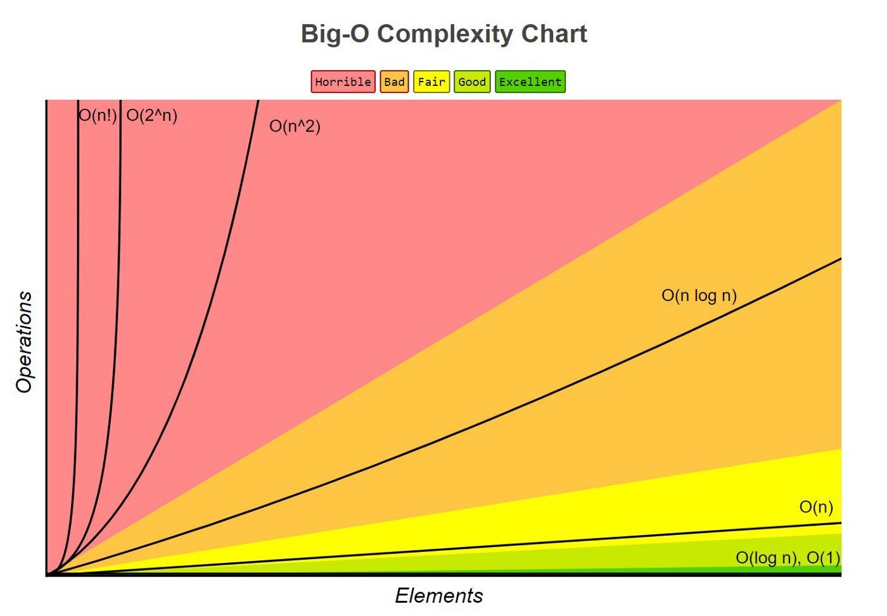

# ARRAY / LIST

| 9 | 7 | 16 | 32 | 209 | 7 | 12 | 120 | 34 |  arr[6] -> num
  0   1   2    3     4    5                              int
                                                         4 bytes
      ______________________
arr  [                      ]               arr[4]                 arr in memory
     [                      ]               @arr(4963) + 4 * size of data (4 bytes)
      ----------------------                @4963 + 16
        24 bytes                            @4979
(4963)

arr2.append(12)
"         "(20)
"         "(34)
"         "(12)

Linear operation O(n) <- n is the len(arr2)
Every piece of data/number of item
- have to do 1 operation per item to get it done

Constant time O(1)
arr[2] -> 16
scales with no real change to the operation



Have to think about how this would scale
i.e. nested to for loops or even break into a few constant or linear time complexities

# Linear time iterate over all items
```
arr = [12, 23, 56, 87, 14] # n = 5
for num in arr: # O(n * 1) ==> O(n)
    print(num) # O(1)
for num in arr: # O(n * 1) ==> O(n)
    print(num) # O(1)
```

content times how many times it loops \
O(n * 1) ==> O(n) \
O(n * 1) + O(n * 1) + O(1) \
O(2n) + O(1) ==> O(n) + O(1) ==> O(n) \
still O(n) because these are separate and not nested loops

# constant time lookup
```
print(arr[3]) #O(1)
```

# quadratic time nested iteration
```
for x in arr: # O(n)
    for y in arr: # O(n) ==> O(n^2)
        for z in arr: # O(n) ==> O(n^3)
            print(x, y, z) #  O(1) ==> O(1 * n^2)
```
O(n^2) + O(n) + O(1 * n^2) \
O(2n^2) + O(n) ==> O(n^2) + O(n^2) drop constant, coefficients, and smaller complexity \
O(n^2) ==> O(n^3) still represented as O(n^2)

10 * 10 = 100 \
100 * 100 = 1000


# Nodes
                                Singly Linked List
val |  | -> next                    ->Next      ->Next        ->Next
            None                | 2|  |     | 9|  |     |20|  |     | 7|  |
                                 Head                        Tail

class Nodes:                      class Linked_list:
def __init__(self, value):        def __init__(self, value):
     self.value = value                 self.head = None
     self.next = None                   self.tail = None

Singly linked list that are connected to the next list in some way
To get to the 2nd or 3rd node you would have to move each item to get to it

head       tail                                 head -> None   None <- tail
    |     |
    v     v
    | 20 |  | -> None

Adding a new node instead of allocating different points in memory when appending or deleting a list.
```
n1 = Node(1)
n2 = Node(2)
n3 = Node(3)
n4 = Node(4)
n5 = Node(5)

n1.next_node = n2
n2.next_node = n3
n3.next_node = n5
n5.next_node = n4

1
2
3
4
5

n4.next_node = n5
n5.next_node = n4
```
#Pros and Cons of Linked Lists

Unlike arrays, linked lists do not store elements contiguoulsy

    * Pro: Easier to insert into and delet from the middle of a linked list compared to an array (why is this the case?)

    * Con: Linked lists are not as cache-friendly since caches are typically optimized for contiguous memory accesses.

Linked lists do not need to be allocated with static amount of memory up-front.

    * Pro: We can keep adding elements to linked lists as much as we want, unlike arrays with the static amount of allocated memory


# Queue


Last in first out for linked list

whereas, for queue it's


# Stack

