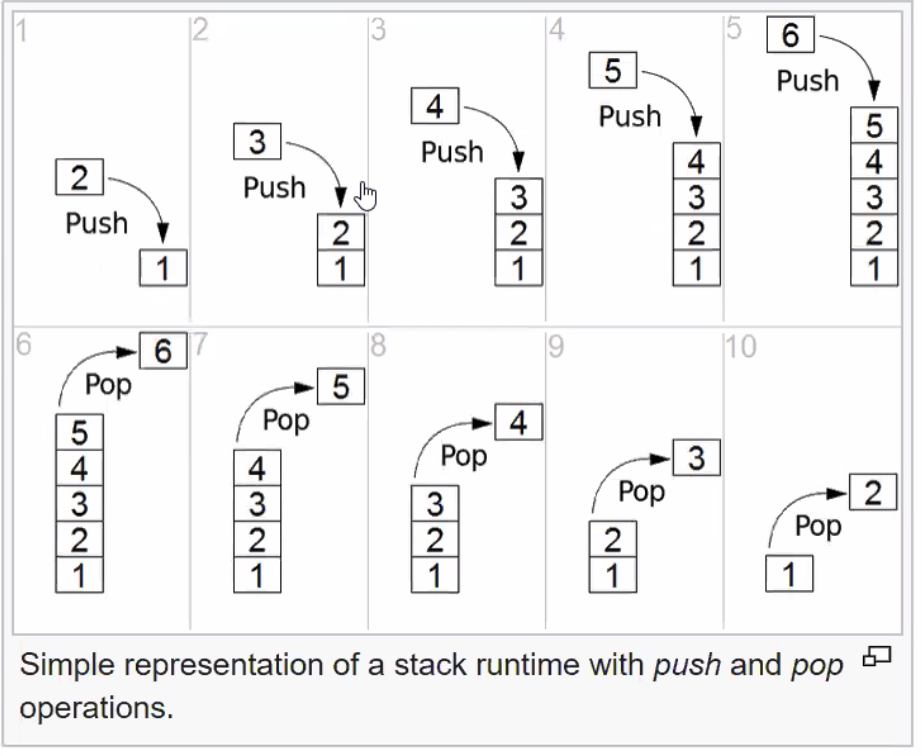

## Review
https://dev.to/adavidoaiei/fundamental-data-structures-and-algorithms-in-c-4ocf
https://visualgo.net/en/list?slide=6

# Time Complexity
Refers to Big O

# Space Complexity
size of memory used

Array
IDx
   0   1   2   3   4 --> 5
[ [1] [3] [5] [7] [22]  []     ]
                  ^
                  |
                [12]

O(n)

To delete O(n)
To insert O(n)

Linked List
 H          T
 ^          ^
 |          |
[ ]->[ ]->[ ]->
    ^
    |
   [ ]

insert O(1)
delete O(n)

### Stacks

### Queue

### Doubly Linked List
DLL            SLL
value          value
next           next
previous
- both have H-T

            ->N   ->N    ->N    ->N    ->N    ->N
None <-[ ]<-->[ ]<-->[ ]<-->[ ]<-->[ ]<-->[ ]<-->None
     -P    -P   ->P    ->P    ->P    ->P    ->P
