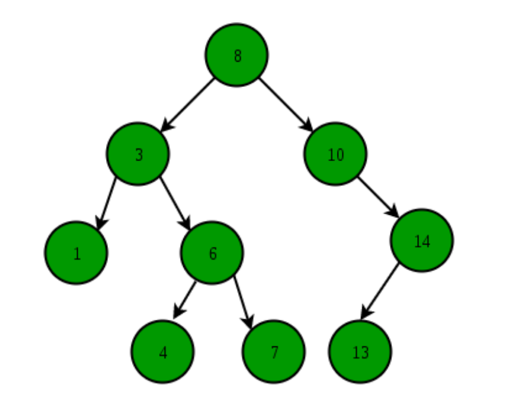
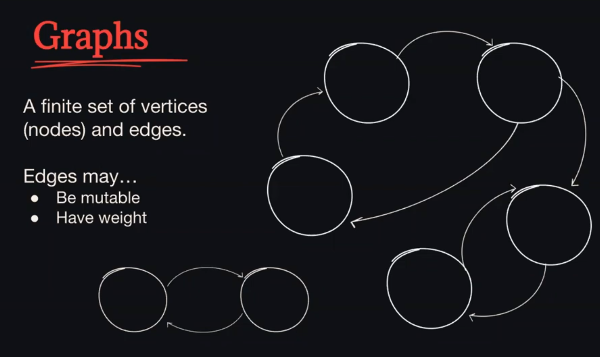
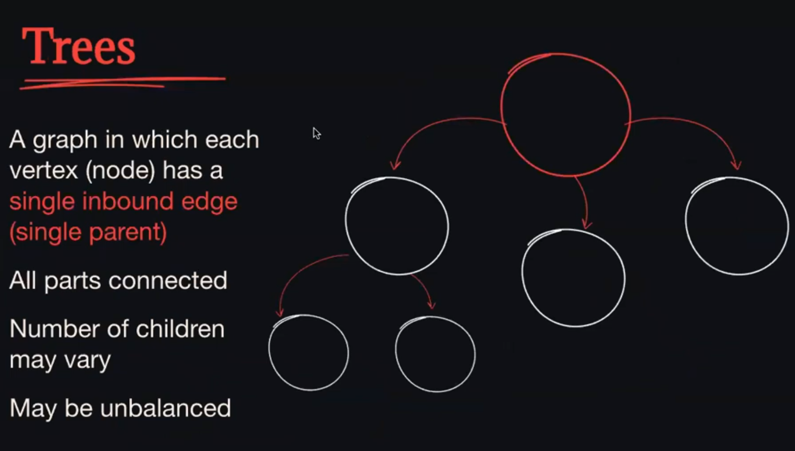
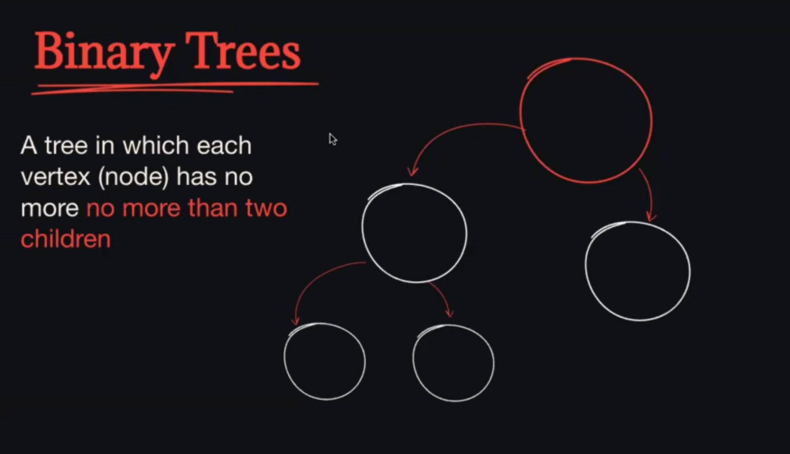
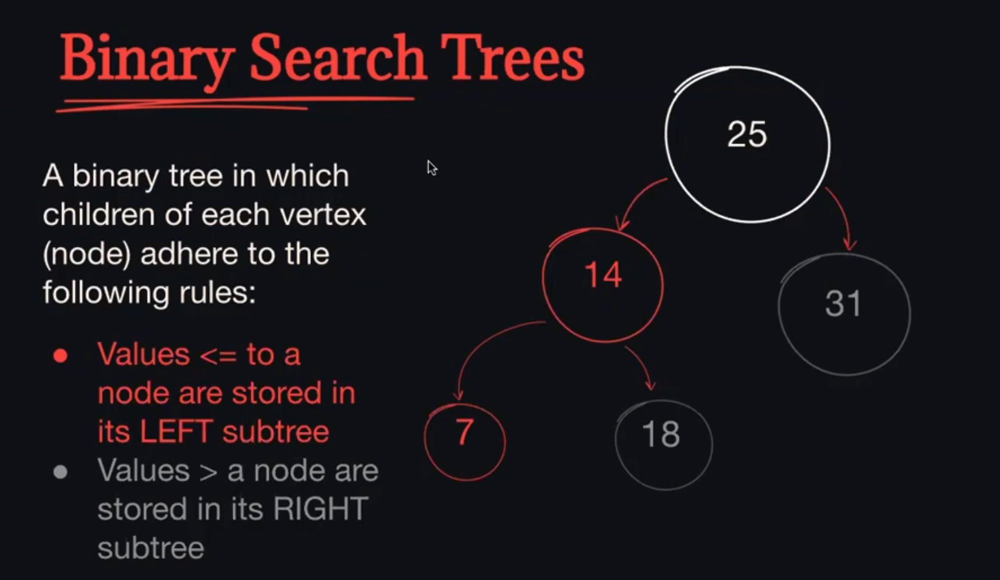

# Binary Search Tree
- https://www.geeksforgeeks.org/binary-search-tree-data-structure/

Order 
- 
- 
- 
- 

Binary Search Tree \
is a node based binary tree data structure whcih has the following properties:
- The left subtree of a node contains only nodes with keys lesser than the node's key
- The right subtree of a node contains only nodes with keys greater than the node's keys
- The left and right subtree each must also be a binary search tree.

https://www.cs.usfca.edu/~galles/visualization/BST.html

Insert
- check if the new nodes value is less than the current nodes value
- if there is no left child already there
- add the new node to the left
- otherwise call insert on the left node
- otherwise (the new nodes value is greater than or equal to the current node value)
- if there is no right child already there
- add the new node to the right
- otherwise call insert on the left node